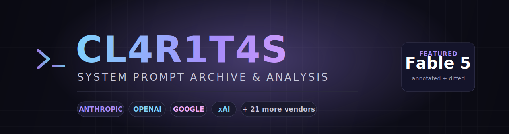
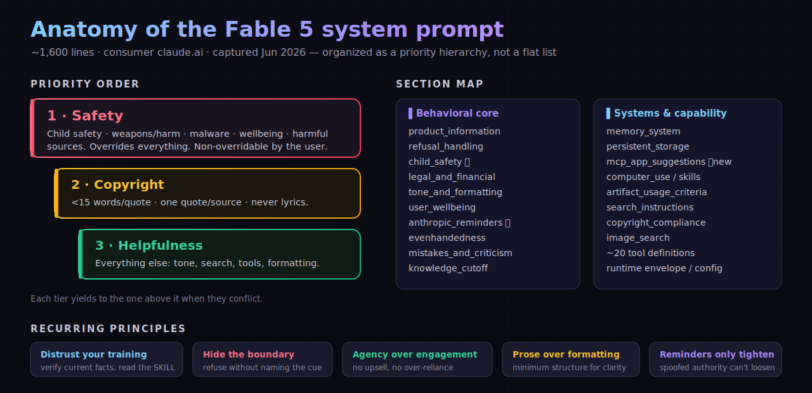

<div align="center">



<br/>

**A curated archive of extracted LLM system prompts — with original, annotated analysis of Claude Fable 5.**

<br/>


<br/>

[**✨ Annotated Fable 5**](ANTHROPIC/CLAUDE-FABLE-5-ANNOTATED.md) &nbsp;·&nbsp;
[**⚡ Cheat Sheet**](ANTHROPIC/CLAUDE-FABLE-5-CHEATSHEET.md) &nbsp;·&nbsp;
[**🥷 Jailbreak Defenses**](ANTHROPIC/CLAUDE-FABLE-5-JAILBREAK-DEFENSE.md) &nbsp;·&nbsp;
[**🔬 Generational Diff**](diff-analysis/fable5-vs-opus47.md) &nbsp;·&nbsp;
[**📄 Raw Prompt**](ANTHROPIC/CLAUDE-FABLE-5.md)

</div>

---

## 🌟 Why this repo

Most prompt dumps are a wall of raw text — accurate, but exhausting to actually *read*. This repo
keeps the raw extractions **and** layers genuinely useful work on top:

> 🧠 **An [annotated study edition](ANTHROPIC/CLAUDE-FABLE-5-ANNOTATED.md)** of the Claude Fable 5
> system prompt — every section paired with commentary on *what the rule does, why it exists, and
> the failure mode it guards against*, plus a cross-linked table of contents and an annotated tool
> catalog.
>
> 🔬 **A [generational diff](diff-analysis/fable5-vs-opus47.md)** tracing exactly what changed from
> Claude Opus 4.7 → Fable 5: the new Mythos-class tier, removed sections, tightened safety rules,
> and a stale model-ID bug that survived the version bump.
>
> 🥷 **A [jailbreak-defense map](ANTHROPIC/CLAUDE-FABLE-5-JAILBREAK-DEFENSE.md)** linking 12 common
> attack patterns to the exact prompt mechanisms that counter them — and an
> **[⚡ one-page cheat sheet](ANTHROPIC/CLAUDE-FABLE-5-CHEATSHEET.md)** of the whole rulebook.

---

## 🧬 How the prompt is built

<div align="center">

</div>

The Fable 5 prompt is a **priority hierarchy, not a flat list**: safety overrides copyright
overrides helpfulness, with child-safety non-overridable on top. The
[annotated edition](ANTHROPIC/CLAUDE-FABLE-5-ANNOTATED.md) walks every section in detail.

---

## ⚡ Quick start

```bash
git clone https://github.com/aashishbharti04/cl4r1t4s-archive.git
cd cl4r1t4s-archive

# read the good stuff
code ANTHROPIC/CLAUDE-FABLE-5-ANNOTATED.md
code diff-analysis/fable5-vs-opus47.md
```

---

## 📂 What's inside

<table>
<tr>
<td valign="top" width="50%">

**🟣 Anthropic** &nbsp;·&nbsp; [`ANTHROPIC/`](ANTHROPIC/)
- ✨ [`CLAUDE-FABLE-5-ANNOTATED.md`](ANTHROPIC/CLAUDE-FABLE-5-ANNOTATED.md)
- ⚡ [`CLAUDE-FABLE-5-CHEATSHEET.md`](ANTHROPIC/CLAUDE-FABLE-5-CHEATSHEET.md)
- 🥷 [`CLAUDE-FABLE-5-JAILBREAK-DEFENSE.md`](ANTHROPIC/CLAUDE-FABLE-5-JAILBREAK-DEFENSE.md)
- 📄 [`CLAUDE-FABLE-5.md`](ANTHROPIC/CLAUDE-FABLE-5.md) (raw)
- `Claude-Opus-4.7.txt`, `Claude_Opus_4.6.txt`, `Sonnet 4.5/3.7/3.5`, …

**🔬 Analysis** &nbsp;·&nbsp; [`diff-analysis/`](diff-analysis/)
- [`fable5-vs-opus47.md`](diff-analysis/fable5-vs-opus47.md)

</td>
<td valign="top" width="50%">

**🛠️ Coding agents**
`CURSOR/` · `CLINE/` · `DEVIN/` · `REPLIT/`
`WINDSURF/` · `BOLT/` · `VERCEL V0/` · `FACTORY/`

**🌐 Models & assistants**
`OPENAI/` · `GOOGLE/` · `XAI/` · `PERPLEXITY/`
`META/` · `MISTRAL/` · `MOONSHOT/` · `MINIMAX/`

**💬 Apps & others**
`DIA/` · `BRAVE/` · `HUME/` · `MANUS/`
`LOVABLE/` · `CLUELY/` · `MULTION/` · `SAMEDEV/`

</td>
</tr>
</table>

<details>
<summary><b>🗂️ Full directory tree</b></summary>

```
cl4r1t4s-archive/
├── ANTHROPIC/
│   ├── CLAUDE-FABLE-5-ANNOTATED.md   ✨ annotated study edition
│   ├── CLAUDE-FABLE-5.md             📄 raw extraction
│   ├── Claude-Opus-4.7.txt
│   ├── Claude_Opus_4.6.txt
│   ├── Claude_Sonnet-4.5_Sep-29-2025.txt
│   └── … (13 files total)
├── diff-analysis/
│   └── fable5-vs-opus47.md           🔬 generational comparison
├── OPENAI/  GOOGLE/  XAI/  PERPLEXITY/  META/  MISTRAL/ …
├── CURSOR/  CLINE/  DEVIN/  REPLIT/  WINDSURF/  BOLT/ …
├── assets/
│   └── banner.svg
└── README.md
```

</details>

---

## 🧭 Highlights from the analysis

<details open>
<summary><b>What changed: Opus 4.7 → Fable 5</b></summary>

<br/>

| Area | Change |
|---|---|
| 🆕 **Tier** | New **Mythos-class** above Opus; Fable 5 + Mythos 5 share weights, different guardrails |
| 🔢 **Models** | Opus `4.7 → 4.8`; Sonnet/Haiku steady; cutoff held at **Jan 2026** |
| 🧰 **Products** | + Claude in **PowerPoint**; Claude Code reaches desktop + mobile |
| ➖ **Removed** | `default_stance`, inline visualizer, `tool_discovery`, `past_chats_tools` |
| ➕ **Added** | `mcp_app_suggestions` (connector etiquette / anti-monetization-bias) |
| 🛡️ **Tightened** | Child-safety + wellbeing sections grew materially more specific |
| 🐛 **Stale bug** | Claudeception example still hardcodes the May-2025 `claude-sonnet-4-20250514` |

Full write-up → [`diff-analysis/fable5-vs-opus47.md`](diff-analysis/fable5-vs-opus47.md)

</details>

---

## 🔎 Provenance & honesty

> [!IMPORTANT]
> The prompt files are **not original work**. They mirror the public
> [`elder-plinius/CL4R1T4S`](https://github.com/elder-plinius/CL4R1T4S) collection (snapshot at
> commit `09916a9`, 2026-06-15). These are **community extractions captured via model
> self-report** — they may paraphrase, reorder, or hallucinate, and are **not guaranteed
> verbatim**. All credit for the source collection goes to the original author.

> [!NOTE]
> The **`diff-analysis/`** and the **annotated edition** are this repo's original contribution.
> Every *verifiable* fact in the Fable 5 prompt (model IDs, tier names, cutoff, product list,
> cited URLs) was checked against ground truth and matches — but treat behavioral *wording* as
> faithful-but-approximate.

---

<div align="center">

<sub>🗃️ Personal archive · mirror + original analysis · not affiliated with Anthropic</sub>

<br/>

[⬆ back to top](#)

</div>
